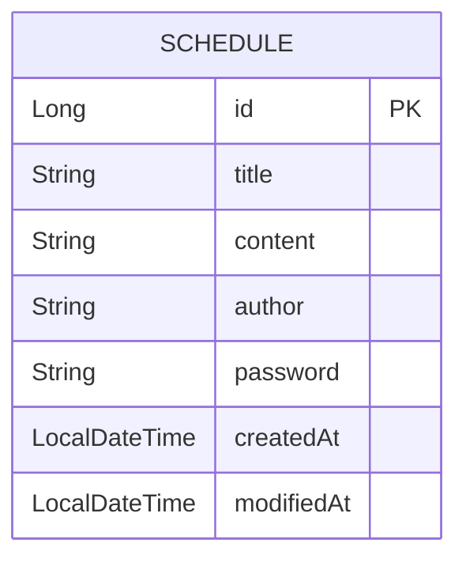

# 🗓️ Schedule Management API (Spring Boot + JPA + Lombok)

> 일정 생성, 조회, 수정, 삭제를 지원하는 RESTful API  
> JPA Auditing으로 작성일/수정일 자동 관리  
> 비밀번호 검증을 통한 수정·삭제 보호  

---

## ⚙️ 기술 스택

| 구분 | 사용 기술                               |
|------|-------------------------------------|
| Language | Java 17+                            |
| Framework | Spring Boot 3.x                     |
| ORM | Spring Data JPA                     |
| DB | MySQL                               |
| Lombok | DTO/Entity 자동 생성                    |
| Build Tool | Gradle or Maven                     |
| Auditing | `@CreatedDate`, `@LastModifiedDate` |

---

## 🗺️ ERD (Entity Relationship Diagram)

- 하나의 테이블(`SCHEDULE`)에서 모든 일정 정보를 관리  
- 비밀번호는 일정별로 따로 저장  
- Auditing으로 작성일·수정일 자동 기록  

---
## 📊 일정 관리 API 명세서

| 구분       | HTTP Method | Endpoint              | 설명                       | 요청 파라미터 (Query / Path) | 요청 Body                                                                  | 응답 Body                                                                                                           | 상태 코드                                         |
| -------- | ----------- | --------------------- | ------------------------ | ---------------------- | ------------------------------------------------------------------------ | ----------------------------------------------------------------------------------------------------------------- | --------------------------------------------- |
| 일정 생성    | **POST**    | `/api/schedules`      | 새로운 일정을 생성               | 없음                     | `title`: 일정 제목 `content`: 일정 내용 `author`: 작성자명 `password`: 비밀번호 | `id`: 고유 ID `title`: 제목 `content`: 내용 `author`: 작성자 `createdAt`: 작성일 `modifiedAt`: 수정일             | `201 Created`                                 |
| 전체 일정 조회 | **GET**     | `/api/schedules`      | 전체 일정 또는 작성자 기준 조회       | `author` (선택): 작성자명    | 없음                                                                       | `[ {id, title, content, author, createdAt, modifiedAt}, ... ]`                                                    | `200 OK`                                      |
| 선택 일정 조회 | **GET**     | `/api/schedules/{id}` | 특정 일정 단건 조회              | `id`: 일정 ID (path)     | 없음                                                                       | `id`: 일정 ID `title`: 제목 `content`: 내용 `author`: 작성자 `createdAt`: 작성일 `modifiedAt`: 수정일             | `200 OK`, `404 Not Found`                     |
| 일정 수정    | **PUT**     | `/api/schedules/{id}` | 일정 제목 및 작성자 수정 (비밀번호 필요) | `id`: 일정 ID (path)     | `title`: 수정할 제목 `author`: 수정할 작성자명 `password`: 비밀번호                | `id`: 일정 ID `title`: 수정된 제목 `content`: 기존 내용 `author`: 수정된 작성자명 `createdAt`: 작성일 `modifiedAt`: 수정일 | `200 OK`, `401 Unauthorized`, `404 Not Found` |
| 일정 삭제    | **DELETE**  | `/api/schedules/{id}` | 선택한 일정 삭제 (비밀번호 필요)      | `id`: 일정 ID (path)     | `password`: 비밀번호                                                         | `message`: “일정이 성공적으로 삭제되었습니다.”                                                                                   | `200 OK`, `401 Unauthorized`, `404 Not Found` |

## 🧠 전체 동작 요약

1. **생성 (POST)** → 일정 추가 (Auditing으로 날짜 자동 저장)  
2. **조회 (GET)** → 전체 or 작성자별 or ID별 조회  
3. **수정 (PUT)** → 비밀번호 일치 시 제목/작성자 수정 가능  
4. **삭제 (DELETE)** → 비밀번호 일치 시 삭제 가능

---

## 💬 예외 응답 예시

| 상황 | 상태코드 | 예시 메시지 |
|------|-----------|--------------|
| 존재하지 않는 일정 | 400 | "일정을 찾을 수 없습니다. id=10" |
| 비밀번호 불일치 | 400 | "비밀번호가 일치하지 않습니다." |
| 서버 오류 | 500 | "서버 에러: ..." |

