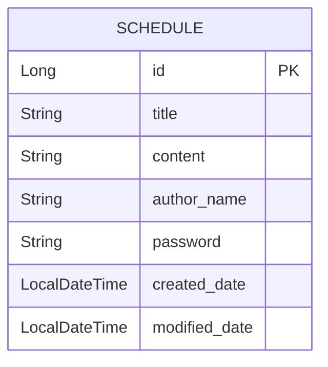

# 🗓️ Schedule Management API (Spring Boot + JPA + Lombok)

> 일정 생성, 조회, 수정, 삭제를 지원하는 RESTful API  
> JPA Auditing으로 작성일/수정일 자동 관리  
> 비밀번호 검증을 통한 수정·삭제 보호  

---

## ⚙️ 기술 스택

| 구분 | 사용 기술 |
|------|------------|
| Language | Java 17+ |
| Framework | Spring Boot 3.x |
| ORM | Spring Data JPA |
| DB | H2 (메모리 DB, 테스트용) |
| Lombok | DTO/Entity 자동 생성 |
| Build Tool | Gradle or Maven |
| Auditing | `@CreatedDate`, `@LastModifiedDate` |

---

## 🗺️ ERD (Entity Relationship Diagram)



- 하나의 테이블(`SCHEDULE`)에서 모든 일정 정보를 관리  
- 비밀번호는 일정별로 따로 저장  
- Auditing으로 작성일·수정일 자동 기록  

---

## 📄 API 명세서

### ✅ 일정 생성 (Create)

| 구분 | 내용 |
|------|------|
| **Method** | `POST` |
| **URL** | `/api/schedules` |
| **Request Body (JSON)** |
| | ```json
{
  "title": "프로젝트 회의",
  "content": "다음 주 월요일 오후 2시 회의",
  "authorName": "홍길동",
  "password": "1234"
}
``` |
| **Response (200 OK)** |
| | ```json
{
  "id": 1,
  "title": "프로젝트 회의",
  "content": "다음 주 월요일 오후 2시 회의",
  "authorName": "홍길동",
  "createdDate": "2025-11-04T14:22:31",
  "modifiedDate": "2025-11-04T14:22:31"
}
``` |

---

### 🔍 전체 일정 조회 (Read All)

| 구분 | 내용 |
|------|------|
| **Method** | `GET` |
| **URL** | `/api/schedules` |
| **Query Param (optional)** | `authorName` : 특정 작성자만 조회 가능 |
| **Response (200 OK)** |
| | ```json
[
  {
    "id": 3,
    "title": "회의 준비",
    "content": "자료 취합하기",
    "authorName": "박지민",
    "createdDate": "2025-11-02T10:21:00",
    "modifiedDate": "2025-11-03T09:00:00"
  },
  {
    "id": 2,
    "title": "출근",
    "content": "08:30까지 도착",
    "authorName": "홍길동",
    "createdDate": "2025-11-01T08:00:00",
    "modifiedDate": "2025-11-01T08:00:00"
  }
]
``` |
| **정렬 기준** | `modifiedDate` 내림차순 |

---

### 🔎 단건 일정 조회 (Read One)

| 구분 | 내용 |
|------|------|
| **Method** | `GET` |
| **URL** | `/api/schedules/{id}` |
| **Response (200 OK)** |
| | ```json
{
  "id": 1,
  "title": "프로젝트 회의",
  "content": "다음 주 월요일 오후 2시 회의",
  "authorName": "홍길동",
  "createdDate": "2025-11-04T14:22:31",
  "modifiedDate": "2025-11-04T14:22:31"
}
``` |

---

### 🛠️ 일정 수정 (Update)

| 구분 | 내용 |
|------|------|
| **Method** | `PUT` |
| **URL** | `/api/schedules/{id}` |
| **Request Body (JSON)** |
| | ```json
{
  "title": "프로젝트 회의(수정)",
  "authorName": "홍길동",
  "password": "1234"
}
``` |
| **Response (200 OK)** |
| | ```json
{
  "id": 1,
  "title": "프로젝트 회의(수정)",
  "content": "다음 주 월요일 오후 2시 회의",
  "authorName": "홍길동",
  "createdDate": "2025-11-04T14:22:31",
  "modifiedDate": "2025-11-04T14:30:22"
}
``` |

> ⚠️ 작성일은 변경되지 않으며, 수정일은 자동 갱신됩니다.  
> 비밀번호가 틀리면 `400 Bad Request` 반환

---

### 💣 일정 삭제 (Delete)

| 구분 | 내용 |
|------|------|
| **Method** | `DELETE` |
| **URL** | `/api/schedules/{id}` |
| **Request Body (JSON)** |
| | ```json
{
  "password": "1234"
}
``` |
| **Response (204 No Content)** | 삭제 성공 시 본문 없음 |

> 비밀번호가 일치하지 않으면 `400 Bad Request` 발생  

---

## 🧠 전체 동작 요약

1. **생성 (POST)** → 일정 추가 (Auditing으로 날짜 자동 저장)  
2. **조회 (GET)** → 전체 or 작성자별 or ID별 조회  
3. **수정 (PUT)** → 비밀번호 일치 시 제목/작성자 수정 가능  
4. **삭제 (DELETE)** → 비밀번호 일치 시 삭제 가능  

---

## 🧩 실행 방법

```bash
# 1. Clone repository
git clone https://github.com/your-username/schedule-api.git
cd schedule-api

# 2. Run Spring Boot app
./gradlew bootRun

# 3. API 테스트 (H2 메모리 DB)
#   → http://localhost:8080/h2-console
#   → JDBC URL: jdbc:h2:mem:testdb
```

---

## 💬 예외 응답 예시

| 상황 | 상태코드 | 예시 메시지 |
|------|-----------|--------------|
| 존재하지 않는 일정 | 400 | "일정을 찾을 수 없습니다. id=10" |
| 비밀번호 불일치 | 400 | "비밀번호가 일치하지 않습니다." |
| 서버 오류 | 500 | "서버 에러: ..." |

---

## 🧱 Author & License

**Author:** 개발자 홍길동  
**License:** MIT  
**Date:** 2025.11  

---

> 🚀 *“기억해야 할 일들은 많지만, 잘 관리된 일정은 당신의 하루를 구한다.”*  
> — _Schedule Management API_
